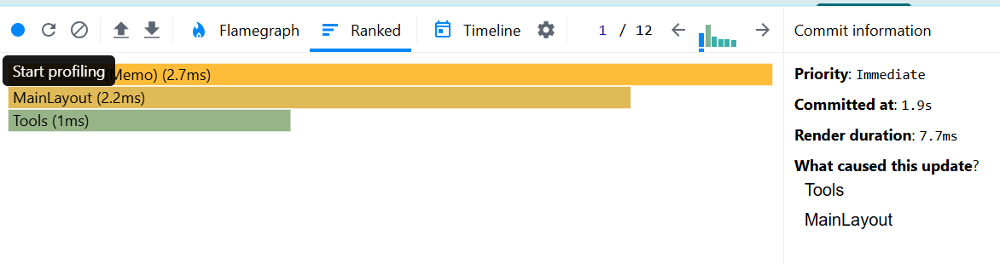

# Performance Analysis (Before Optimization)

## Profiler Results
Below are the performance metrics recorded using the React DevTools Profiler prior to optimization:

### Commit Duration
- The application committed updates in **3.2 seconds**.

### Render Duration
- Total time taken to render components: **35.9ms**.

## Component-Level Breakdown
Here's the rendering time for key components:
- **MainLayout**: **0.4ms**
- **CountriesList**: **1.6ms**
- **CountryItem**:
    - With `key="Bulgaria"`: **1.2ms**
    - Other `CountryItem` components: **0.1ms - 0.4ms**

### Render Duration of CountriesList by Interactions:
- **Sort by population**: **6.9s for 27.5ms**
- **Sort by name**: **9s for 24.9ms**
- **Filter by region**: **13.1s for 11.9ms**
- **Reset**: **15.1s for 109ms**
- **Search by word**: **19.6s for 0.5ms**

# Performance Analysis (After Optimization)

## Profiler Results
Below are the performance metrics recorded using the React DevTools Profiler after the optimization (adding React.memo to `CountriesList` and `CountryItem` components and adding `useCallback`and `useMemo` to filter functions):

### Commit Duration
- The application committed updates in **1.9 seconds**.

### Render Duration
- Total time taken to render components: **7.7ms**.

## Component-Level Breakdown
Here's the rendering time for key components:
- **MainLayout**: **2.2ms**
- **CountriesList**: **2.7ms**
- **Tools**: **1ms**
  

### Render Duration of CountriesList by Interactions:
- **Sort by population**: **2.3s for 3.7ms**
- **Sort by name**: **4.1s for 4.3ms**
- **Filter by region**: **10.7s for 2.7ms**
- **Reset**: **17s for 144ms**
- **Search by word**: **21.5s for 1.4ms**

