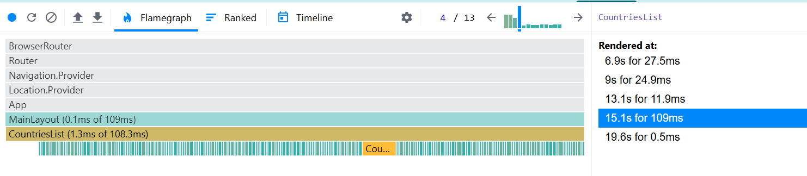
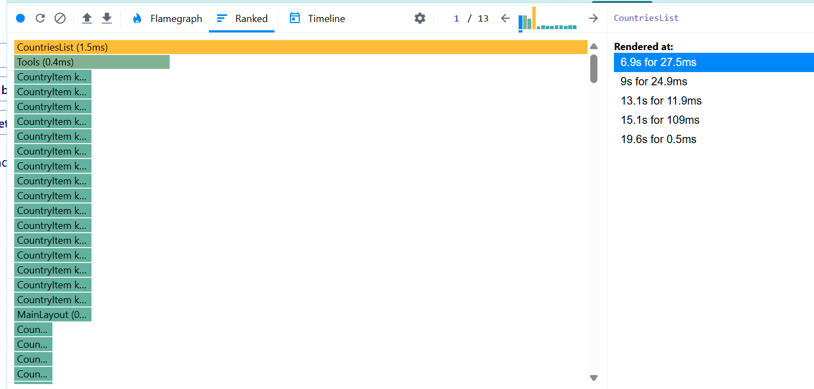
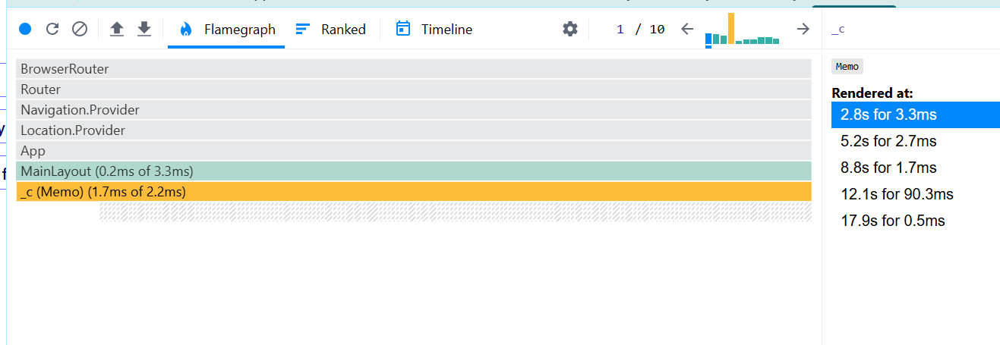
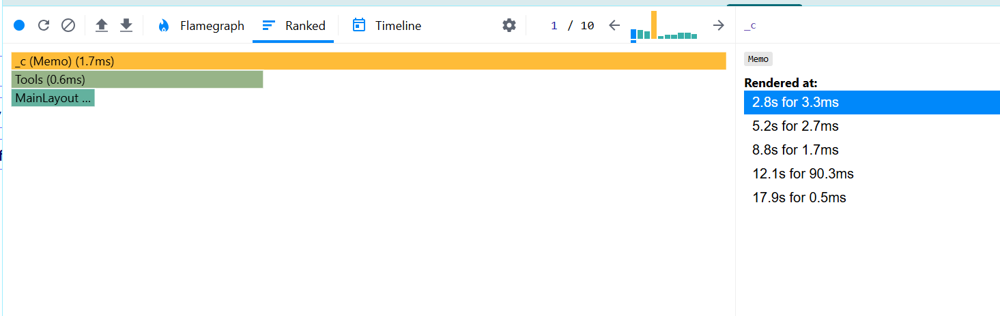

# Performance Analysis (Before Optimization)

## Profiler Results
Below are the performance metrics recorded using the React DevTools Profiler prior to optimization:

### Commit Duration
- The application committed updates in **3.2 seconds**.

### Render Duration
- Total time taken to render components: **35.9ms**.

## Component-Level Breakdown
Here's the rendering time for key components:
- **MainLayout**: **0.4ms**
- **CountriesList**: **1.6ms**
- **CountryItem**:
    - With `key="Bulgaria"`: **1.2ms**
    - Other `CountryItem` components: **0.1ms - 0.4ms**

### Render Duration of CountriesList by Interactions:
- **Sort by population**: **6.9s for 27.5ms**
- **Sort by name**: **9s for 24.9ms**
- **Filter by region**: **13.1s for 11.9ms**
- **Reset**: **15.1s for 109ms**
- **Search by word**: **19.6s for 0.5ms**

# Performance Analysis (After Optimization)

## Profiler Results
Below are the performance metrics recorded using the React DevTools Profiler after the optimization (adding React.memo to `CountriesList` and `CountryItem` components and adding `useCallback`and `useMemo` to filter functions):

### Commit Duration
- The application committed updates in **1.8 seconds**.

### Render Duration
- Total time taken to render components: **5.8ms**.

## Component-Level Breakdown
Here's the rendering time for key components:
- **MainLayout**: **1.9ms**
- **CountriesList**: **2ms**

### Render Duration of CountriesList by Interactions:
- **Sort by population**: **1.8s for 5.8ms**
- **Sort by name**: **3.7s for 3.9ms**
- **Filter by region**: **7.3s for 2.8ms**
- **Reset**: **9s for 94.6ms**
- **Search by word**: **12.7s for 1.2ms**

